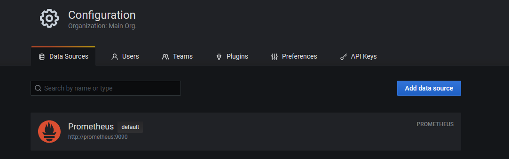

# Обязательные задания

## Задание 1

1. Используя директорию [help](./help/) внутри этого домашнего задания, запустите связку prometheus-grafana.


2. Зайдите в веб-интерфейс grafana, используя авторизационные данные, указанные в манифесте docker-compose.


3. Подключите поднятый вами prometheus, как источник данных.


4. Решение домашнего задания — скриншот веб-интерфейса grafana со списком подключенных Datasource.



## Задание 2

Изучите самостоятельно ресурсы:

1. [PromQL tutorial for beginners and humans.](https://valyala.medium.com/promql-tutorial-for-beginners-9ab455142085)
2. [Understanding Machine CPU usage.](https://www.robustperception.io/understanding-machine-cpu-usage)
3. [Introduction to PromQL, the Prometheus query language.](https://grafana.com/blog/2020/02/04/introduction-to-promql-the-prometheus-query-language/)

Создайте Dashboard и в ней создайте Panels:
    
утилизация CPU для nodeexporter (в процентах, 100-idle);

```
(sum by(instance) (irate(node_cpu_seconds_total{instance="nodeexporter:9100",job="nodeexporter", mode!="idle"}[$__rate_interval])) / on(instance) group_left sum by (instance)((irate(node_cpu_seconds_total{instance="nodeexporter:9100",job="nodeexporter"}[$__rate_interval])))) * 100
```

CPULA 1/5/15;

```
node_load1{instance="nodeexporter:9100",job="nodeexporter"}

node_load5{instance="nodeexporter:9100",job="nodeexporter"}

node_load15{instance="nodeexporter:9100",job="nodeexporter"}
```

количество свободной оперативной памяти;

```
100 - ((avg_over_time(node_memory_MemAvailable_bytes{instance="nodeexporter:9100",job="nodeexporter"}[$__rate_interval]) * 100) / avg_over_time(node_memory_MemTotal_bytes{instance="nodeexporter:9100",job="nodeexporter"}[$__rate_interval]))
```

количество места на файловой системе.

```
100 - ((avg_over_time(node_filesystem_avail_bytes{instance="nodeexporter:9100",job="nodeexporter",mountpoint="/",fstype!="rootfs"}[$__rate_interval]) * 100) / avg_over_time(node_filesystem_size_bytes{instance="nodeexporter:9100",job="nodeexporter",mountpoint="/",fstype!="rootfs"}[$__rate_interval]))
```

Для решения этого задания приведите promql-запросы для выдачи этих метрик, а также скриншот получившейся Dashboard.


## Задание 3

1. Создайте для каждой Dashboard подходящее правило alert — можно обратиться к первой лекции в блоке «Мониторинг».
2. В качестве решения задания приведите скриншот вашей итоговой Dashboard.


## Задание 4

1. Сохраните ваш Dashboard.Для этого перейдите в настройки Dashboard, выберите в боковом меню «JSON MODEL». Далее скопируйте отображаемое json-содержимое в отдельный файл и сохраните его.
2. В качестве решения задания приведите листинг этого файла.

[testpanel](./testpanel.json)

